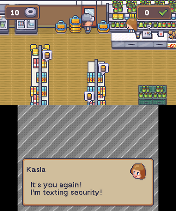

?> Chcesz zobaczyć tu swoją grę lub bibliotekę? Napisz na serwerze Discord!

## Nintendo Switch

### LoveStory

#### autorstwa **Shrike**

[LoveStory](https://shrikey.itch.io/lovestory) to biblioteka do tworzenia gier z gatunku Visual Novel dla LÖVE Potion na Nintendo Switch. Celem LoveStory jest uproszczenie procesu tworzenia gier Visual Novel oraz integracja prostego w użyciu Systemu Dialogów dla gier fabularnych na Nintendo Switch.

By stworzyć własną grę Visual Novel, polecam pobrać demo i edytować novel.lua według potrzeby. Pełną dokumentację, jak używać LoveStory, znajdziesz w dokumencie LoveStory Documentation PDF na stronie itch.io.

### DDLC-LOVE

#### autorstwa **LGD**

[DDLC-LOVE](https://github.com/LukeZGD/DDLC-LOVE) to nieoficjalny, wieloplatformowy port Doki Doki Literature Club na Nintendo Switch i inne konsole! Zaprogramowany w Lua, korzystający z frameworku LÖVE Potion.

Klub Książki jest pełen uroczych dziewcząt! Czy uda ci się wpisać w ich serca? Gra nie jest odpowiednia dla dzieci ani osób wrażliwych.

### Mamono Sweeper Switch

#### autorstwa Maurice

[Mamono Sweeper Switch](https://github.com/Stabyourself/mamono-sweeper-switch) jest portem gry [Mamono Sweeper](http://www.hojamaka.com/game/mamono_sweeper_h/html5/en.html).

## Nintendo 3DS

### TaśmanQuest

#### autorstwa Nawiasa

[TaśmanQuest](https://nawias.itch.io/tasmanquest) to krótka gra zręcznościowa na Nintendo 3DS! Zwiedź słynny księżomierski sklep Lewiatan i wytęż swoje umiejętności taśmowania w walce z czasem!

## Nintendo Wii U

Nic tu jeszcze nie ma!
